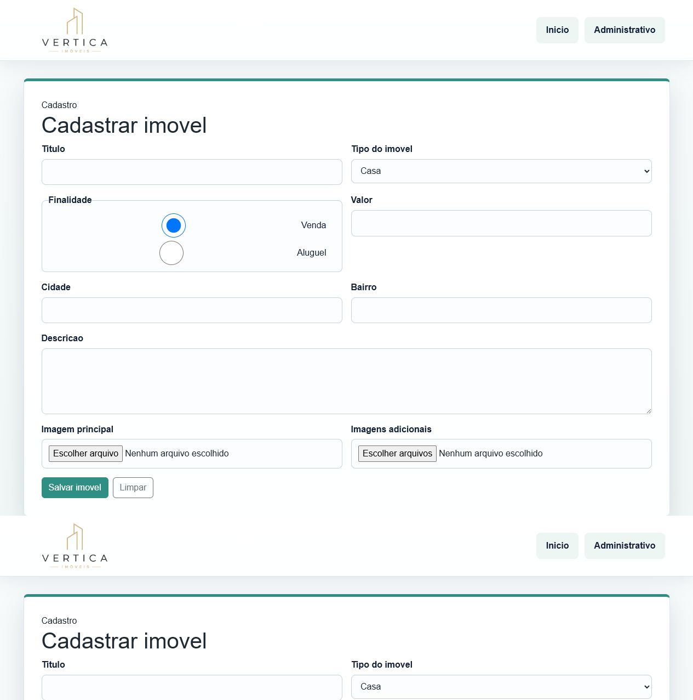

# Documentacao do Sistema Web para Imobiliaria

## Identificacao

Integrante: Willian / responsavel pelo repositorio `will1806e/site-imobiliaria-trabalho`.

Tema do sistema: plataforma web simples para controle de uma imobiliaria.

## Descricao do projeto

O projeto simula um site de imobiliaria com uma pagina inicial publica e uma area administrativa. Na pagina inicial o visitante visualiza os imoveis cadastrados, com imagem, titulo, descricao, tipo, finalidade, valor, cidade e bairro. Na area administrativa o usuario pode cadastrar novos imoveis, consultar a lista completa, editar dados existentes e excluir registros.

O sistema foi desenvolvido com PHP e MySQL no backend, HTML/CSS no frontend e Bootstrap para componentes de interface. Nesta maquina, o MySQL do XAMPP foi configurado na porta `3307`, porque a porta `3306` ja estava ocupada pelo servico `MySQL80`.

## Funcionalidades implementadas

- Visualizacao dos imoveis na pagina inicial.
- Cadastro de imoveis pela area administrativa.
- Listagem dos imoveis cadastrados em tabela administrativa.
- Edicao de imoveis existentes.
- Exclusao de imoveis.
- Upload de imagem principal obrigatoria.
- Upload de multiplas imagens adicionais.
- Exibicao da imagem principal na pagina inicial.
- Layout organizado e responsivo.
- Arquivo SQL para criacao do banco de dados.

## Estrutura do banco

Banco: `imobiliaria`

Tabela `imoveis`:

- `id`: identificador unico do imovel.
- `titulo`: nome/titulo exibido no catalogo.
- `descricao`: texto descritivo do imovel.
- `tipo_imovel`: tipo, como Casa, Apartamento, Sobrado, Terreno ou Comercial.
- `finalidade`: Venda ou Aluguel.
- `valor`: preco do imovel.
- `cidade`: cidade onde o imovel esta localizado.
- `bairro`: bairro onde o imovel esta localizado.
- `imagem`: nome/caminho da imagem principal.
- `criado_em`: data de criacao do registro.

Tabela `imovel_imagens`:

- `id`: identificador unico da imagem.
- `imovel_id`: referencia ao imovel.
- `imagem`: nome do arquivo de imagem adicional.
- `criado_em`: data de envio da imagem.

## Divisao das tarefas

Willian:

- Criacao da interface inicial.
- Organizacao visual com CSS e Bootstrap.
- Implementacao da conexao com MySQL.
- Criacao do CRUD administrativo.
- Implementacao do upload de imagens.
- Criacao do script SQL do banco.
- Escrita da documentacao.

## Prints do sistema

Pagina inicial com a lista de imoveis:

Area administrativa com formulario, listagem e acoes de editar/excluir:

## Apresentacao

Durante a apresentacao, demonstrar:

- Importacao do arquivo `banco.sql`.
- Abertura da pagina inicial.
- Cadastro de um novo imovel com imagem.
- Edicao do imovel cadastrado.
- Exclusao do imovel.
- Estrutura das tabelas `imoveis` e `imovel_imagens`.
