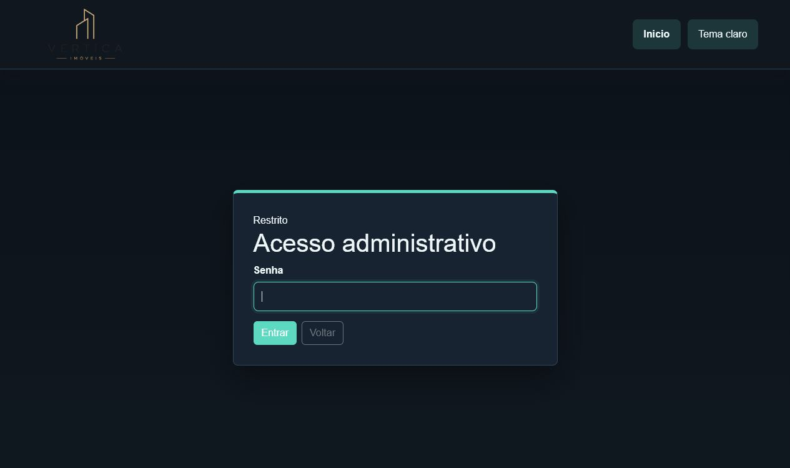
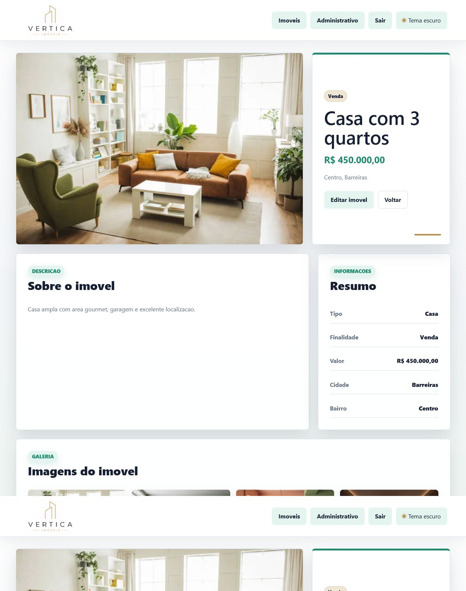

# Documentacao do Sistema Web para Imobiliaria

## Identificacao

Integrantes do grupo:

- Alexandro
- Willian
- Pedro Kalyd

Tema do sistema: desenvolvimento de um sistema web para controle de uma imobiliaria.

Repositorio: `will1806e/site-imobiliaria-trabalho`

## Descricao do projeto

O projeto simula uma plataforma imobiliaria simples. O site possui uma pagina inicial publica para visualizacao dos imoveis cadastrados, uma pagina de detalhes para cada imovel e uma area administrativa protegida por senha.

Na pagina inicial, cada imovel exibe imagem, titulo, descricao, tipo do imovel, finalidade, valor e localizacao. Ao abrir um imovel, o usuario acessa uma pagina detalhada com foto principal, preco, bairro, cidade, descricao completa, resumo das informacoes e galeria de imagens.

Na area administrativa, o administrador pode cadastrar, listar, editar e excluir imoveis. O acesso administrativo e protegido por login. A senha padrao e `admin`, armazenada no codigo como hash, usando `password_verify`.

O sistema foi desenvolvido com PHP, MySQL, HTML, CSS e Bootstrap. Nesta maquina, o MySQL do XAMPP foi configurado na porta `3307`, pois a porta `3306` ja estava ocupada pelo servico `MySQL80`.

## Funcionalidades implementadas

- Pagina inicial com listagem dos imoveis cadastrados.
- Exibicao de imagem, titulo, descricao, tipo, finalidade, valor, cidade e bairro em cada imovel.
- Pagina de detalhes individual para cada imovel.
- Galeria de imagens na pagina de detalhes.
- Area administrativa protegida por login.
- Senha administrativa protegida por hash no codigo.
- Logout do administrador.
- Cadastro de imoveis.
- Listagem administrativa dos imoveis.
- Edicao de imoveis existentes.
- Exclusao de imoveis.
- Upload de imagem principal obrigatoria.
- Upload de multiplas imagens adicionais.
- Armazenamento das imagens na pasta `uploads`.
- Exibicao da imagem principal na pagina inicial.
- Tema claro e tema escuro com preferencia salva no navegador.
- Layout organizado, responsivo e com CSS proprio.
- Navegacao funcional entre pagina inicial, detalhes, login e administracao.
- Arquivo `banco.sql` para criacao do banco de dados e tabelas.

## Estrutura do banco de dados

Banco: `imobiliaria`

### Tabela `imoveis`

Armazena os dados principais de cada imovel.

- `id`: identificador unico do imovel.
- `titulo`: titulo exibido no site.
- `descricao`: descricao completa do imovel.
- `tipo_imovel`: tipo do imovel, como Casa, Apartamento, Sobrado, Terreno ou Comercial.
- `finalidade`: finalidade do imovel, como Venda ou Aluguel.
- `valor`: valor do imovel.
- `cidade`: cidade onde o imovel esta localizado.
- `bairro`: bairro onde o imovel esta localizado.
- `imagem`: nome ou caminho da imagem principal.
- `criado_em`: data de criacao do registro.

### Tabela `imovel_imagens`

Armazena imagens adicionais de cada imovel.

- `id`: identificador unico da imagem.
- `imovel_id`: referencia ao imovel relacionado.
- `imagem`: nome do arquivo de imagem adicional.
- `criado_em`: data de envio da imagem.

## Estrutura do projeto

- `html/index.php`: pagina inicial com a lista dos imoveis.
- `html/imovel.php`: pagina de detalhes do imovel.
- `html/admin.php`: area administrativa para cadastrar, listar, editar e excluir.
- `html/login.php`: login administrativo.
- `html/logout.php`: encerramento da sessao administrativa.
- `html/salvar_imovel.php`: processamento de cadastro e edicao.
- `html/excluir_imovel.php`: processamento de exclusao.
- `php/conexao.php`: conexao com o banco MySQL.
- `php/funcoes.php`: funcoes auxiliares de busca, formatacao e imagens.
- `php/auth.php`: funcoes de autenticacao administrativa.
- `css/styles.css`: estilos gerais, admin, detalhes e temas.
- `css/index.css`: estilos especificos da pagina inicial e cards.
- `js/tema.js`: alternancia entre tema claro e escuro.
- `uploads/`: pasta onde as imagens enviadas ficam armazenadas.
- `banco.sql`: script de criacao do banco e tabelas.

## Como executar

1. Copiar o projeto para a pasta `htdocs` do XAMPP.
2. Iniciar Apache no painel do XAMPP.
3. Iniciar MySQL/MariaDB do XAMPP.
4. Se a porta `3306` estiver ocupada, usar a porta `3307`, como configurado neste projeto.
5. Importar o arquivo `banco.sql` no phpMyAdmin.
6. Acessar `http://localhost/site-imobiliaria-trabalho/html/index.php`.
7. Acessar a area administrativa em `http://localhost/site-imobiliaria-trabalho/html/admin.php`.
8. Fazer login com a senha `admin`.

## Divisao das tarefas

Alexandro:

- Apoio na definicao das funcionalidades do sistema.
- Organizacao dos requisitos do trabalho.
- Apoio na validacao do cadastro, edicao e exclusao de imoveis.

Willian:

- Criacao da estrutura inicial do projeto.
- Implementacao das paginas em PHP.
- Implementacao da conexao com MySQL.
- Implementacao do CRUD administrativo.
- Implementacao do upload de imagens.
- Organizacao do repositorio no GitHub.

Pedro Kalyd:

- Apoio na organizacao visual das telas.
- Apoio na documentacao do sistema.
- Apoio nos testes das principais funcionalidades.
- Conferencia dos requisitos do PDF.

## Prints do sistema

Pagina inicial com a lista de imoveis:

Tela de login administrativo:

Area administrativa com formulario, listagem e acoes de editar/excluir:

Pagina de detalhes do imovel:

## Apresentacao

Durante a apresentacao, o grupo deve demonstrar:

- Funcionamento da pagina inicial.
- Abertura da pagina de detalhes de um imovel.
- Alternancia entre tema claro e tema escuro.
- Login na area administrativa com a senha `admin`.
- Cadastro de um novo imovel com imagem.
- Edicao do imovel cadastrado.
- Exclusao de um imovel.
- Estrutura do projeto.
- Estrutura do banco de dados.
- Tabelas `imoveis` e `imovel_imagens`.
